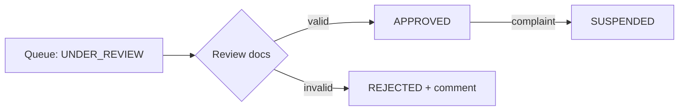

# 10 — Admin Module

The Super Admin console for trust, operations, and platform management. All routes are `@Roles(Role.ADMIN)`.

## Access

- `ADMIN` accounts are provisioned internally — **self-registration as ADMIN is rejected**.
- Admins authenticate like any user but pass `RolesGuard` for admin routes.

## Verification responsibility (who admin approves)

- **Admin approves lawyers only.** Only `Lawyer.verificationStatus` moves through the review queue —
  because a lawyer's bar credentials must be genuine before they're publicly listed.
- **Clients are auto-active after mobile OTP.** There is **no client-approval queue**; a client can act
  as soon as `mobileVerified = true`. Fake/abusive clients are handled by automated controls (OTP,
  reCAPTCHA, lead rate-limits/dedupe) and **reactive suspension** (`UserStatus = SUSPENDED`), not up-front
  approval.
- In the console: **Lawyer Approvals** is a lawyer-only queue; **User Management** *manages/suspends*
  every role but has **no "approve client" action**.

## Dashboard

Operational snapshot:

- Verification queue size (lawyers `UNDER_REVIEW` / `PENDING`).
- New lawyer signups, active subscriptions, trials ending soon, expired subscriptions.
- Leads created (today/7d/30d), lead conversion, document sales/revenue.
- Flags: complaints, suspended lawyers, failed payments.

## Lawyer Approvals (Verification)

- `GET /api/admin/lawyers?status=UNDER_REVIEW` — verification queue.
- Open a lawyer: view profile + **enrollment number** and the uploaded **profile photo + Bar Council certificate** (signed URLs); cross-check the enrollment number against the certificate.
- `PATCH /api/admin/lawyers/:id/verification` — set `APPROVED` / `REJECTED` (with comments) / `SUSPENDED`.
- Every action appends to the `Verification` trail and the `AuditLog`.
- Approving makes the lawyer publicly visible; suspending removes them immediately.

## Moderation (two-sided reports)

Both sides can report the other about a contacted lead — a client reports a lawyer, a lawyer reports a
client (`Report`, reasons: fake profile, misconduct, spam, no-show, abusive, wrong info, other).

- `GET /api/admin/reports?status=OPEN` — the moderation queue (`admin-moderation` UI).
- `PATCH /api/admin/reports/:id` — set `ACTIONED` / `DISMISSED` with an admin note; optionally
  **suspend the reported user** (`UserStatus = SUSPENDED` + revoke sessions) in the same action.
- Every decision writes an `AuditLog` row; the reporter gets a `REPORT_UPDATE` notification.
- Reports never expose the reporter to the reported party.

## User Management (CRUD rules)

Admin has full CRUD over users — with guardrails so records and integrity are preserved:

- **Create / Read / Update:** `GET /api/admin/users` (search/filter), `GET /api/admin/users/:id`,
  `POST /api/admin/users` (provision staff/test accounts), `PATCH /api/admin/users/:id`.
- **Delete = soft delete, never hard delete.** `User` is referenced by `Lead`, `Rating`, `Payment`,
  `Bookmark`, `LeadHistory` — a physical delete would break those and destroy financial/audit records
  you may be legally required to keep. "Delete" sets `status = DELETED` / `deletedAt` (see
  [04-database-design.md](./04-database-design.md)); deactivated users are excluded everywhere and their
  **refresh tokens are revoked** so they're logged out immediately.
- **Account status** (`UserStatus`: `ACTIVE | SUSPENDED | DELETED`): suspend/reactivate; suspended users
  can't log in or act. Suspending a lawyer also removes them from search and stops leads.
- **Passwords are never readable.** Admin can **trigger a password reset** (email link), never view or set
  a raw password.
- Every admin write is recorded in `AuditLog` (actor, action, entity, timestamp).

Admins also view account state, verification/subscription status, and lead activity, and can reset
verification or handle disputes from the user detail view.

## Lawyer Approval (truthy ≠ verified)

A lawyer is `APPROVED` only after a **human review** — automated "all fields filled" checks gate the
*submission*, but never auto-approve.

- **Automated pre-checks (gate submission):** required fields present, **bar number format + uniqueness**,
  valid file types/sizes, and **duplicate detection** (same bar number / mobile / email).
- **Human verification (required for `APPROVED`):** the admin opens the **Bar Council certificate** via
  signed URL and confirms the **enrollment number** matches it and the lawyer is genuine before approving.
- **Decisions:** Approve → `APPROVED`; Reject → `REJECTED` **with a reason** the lawyer sees so they can
  resubmit; Suspend → `SUSPENDED`. Each appends a `Verification` row and an `AuditLog` entry.
- Approving sets `approvedBy`/`approvedAt` and makes the lawyer publicly visible.

## Document Templates (category-wise CRUD)

Admins manage the **document catalog** — categories and templates — not customers' purchased documents.

- `GET/POST/PATCH /api/admin/categories` — manage `DocumentCategory` (name, slug, description).
- `GET/POST/PATCH /api/admin/templates` — create/maintain `DocumentTemplate`: category, title, price,
  input schema (`schemaJson`), body template, `requiresStamp`, and lifecycle.
- **Lifecycle, not hard delete:** templates use a **`DRAFT → PUBLISHED → ARCHIVED`** state plus an
  `active` flag — never physically deleted, because purchased `CustomerDocument`s reference them.
- **Versioning:** editing a published template creates a **new version** so already-purchased documents
  keep the exact template they were generated from. Admins **never** edit a customer's `CustomerDocument`.
- Used by the marketplace ([11-document-marketplace.md](./11-document-marketplace.md)).

## Subscription Plans

- `GET/POST/PATCH /api/admin/plans` — manage `SubscriptionPlanPrice` (plan name + amount).
- Changes affect new purchases; existing subscriptions keep their billed terms.
- See [13-subscription-module.md](./13-subscription-module.md).

## Reports & Analytics

- Lawyer funnel: signups → verified → subscribed → receiving leads.
- Lead funnel: created → contacted → closed; conversion by city/practice area.
- Revenue: subscriptions vs document sales; trials converting to paid.
- Trust metrics: rejection rate, suspensions, complaint volume.
- Export to CSV; deeper analytics in Phase 3.

## Endpoints

| Method | Path | Purpose |
|---|---|---|
| GET | `/api/admin/lawyers?status=` | Verification queue / lawyer search |
| PATCH | `/api/admin/lawyers/:id/verification` | Approve / reject / suspend |
| GET | `/api/admin/users` | User management |
| GET/POST/PATCH | `/api/admin/plans` | Subscription plan prices |
| GET/POST/PATCH | `/api/admin/templates` | Document templates |
| GET | `/api/admin/reports` | Reports & analytics |

## Admin notifications (implemented)

Every active admin gets in-app notifications (`Notification`, channel `IN_APP`) via the global
`NotifyService` (`common/notify`). Bell icon with unread badge in the admin sidebar/mobile bar
(30s polling) → `/admin/notifications` (mark read on click, deep-links, mark-all-read).
Notification writes are fail-safe: they never block the main flow.

| Type | Trigger | Deep link |
|---|---|---|
| `LAWYER_SUBMITTED` | New onboarding submission | `/admin/approvals/:id` |
| `LAWYER_RESUBMITTED` | Rejected lawyer re-uploads + resubmits | `/admin/approvals/:id` |
| `CLIENT_QUERY` | Contact-form submission | `/admin/queries` |
| `REPORT_FILED` | New moderation report | `/admin/moderation` |
| `SUBSCRIPTION_PURCHASED` | Payment verified / plan activated | `/admin/approvals/:id` |

**Lawyer side of the loop (implemented):** rejection sends the decision note in-app + email
(placeholder logger); the dashboard shows a rejection banner with re-upload (ID card + optional
photo) and **Resubmit** (`POST /api/lawyers/me/reverify`) → status returns to `PENDING`, new
`Verification` row, lawyer re-enters the queue, admins get `LAWYER_RESUBMITTED`.

## Admin panel backlog — configurable settings & ops tools

> **Shipped:** P1 items 1–8 and 15 are implemented — `/admin/settings` (PlatformSetting table,
> env fallback, 30s cache, secrets write-only, test-email; wired into Razorpay keys/currency,
> reCAPTCHA toggle+secret, SUPPORT_EMAIL, TRIAL_DAYS), `/admin/transactions` (status filter,
> search, offer/list amount, `PAYMENT_FAILED` admin alert, manual mark-paid reconcile that
> activates the plan + notifies the lawyer), and the `/admin` dashboard home (queue sizes,
> failed payments, monthly revenue, trials expiring; admin login now lands here).
> SMS/WhatsApp/SMTP settings are stored and surfaced but their gateway services are still
> placeholder loggers — wiring a real provider picks the values up from settings.

### P1 — Platform Settings module (single `PlatformSetting` key/value table, secrets masked in UI)
1. **Razorpay / payments**: key id + secret, live/test mode toggle, webhook secret, currency.
2. **SMS gateway** (MSG91/Twilio/TextLocal): provider, API key, sender ID, OTP template id, on/off
   (off = log-only, current dev behaviour).
3. **WhatsApp** (Meta Cloud API/Gupshup): token, phone-number id, template names, on/off.
4. **Email/SMTP**: host/port/user/password, from + support address, "send test email" button.
5. **reCAPTCHA**: site/secret keys, on/off (off = dev token accepted).
6. **Business knobs**: trial days, renewal reminder offsets, bio min length — move from env to admin.

### P1 — Payments & billing ops
7. **Transactions page** (`/admin/transactions`): all `Payment` rows — status filter
   (PAID/FAILED/PENDING), search by lawyer/order id, provider ids, offer applied, amount vs list
   amount; detail drawer with the Razorpay error where captured.
8. **Failed-payment notification** (`PAYMENT_FAILED` admin notification + optional daily digest).
9. **Reconcile action**: re-query Razorpay for an order stuck PENDING; manual mark-paid with note.
10. **Refunds**: initiate/record a refund against a payment (updates subscription accordingly).

### Compliance (shipped)
- **GST invoices**: Settings → Billing & GST group (GSTIN, legal name, address, rate, prefix);
  `Payment.invoiceNo` assigned sequentially on first download (`GET
  /api/subscriptions/admin/payments/:id/invoice`, FINANCE scope, audit-logged); printable
  invoice view at `/admin/transactions/invoice/:id` (browser print → PDF) with taxable/GST
  breakup and offer disclosure.
- **DPDP tooling**: `GET /api/admin/users/:id/export` (OPS) — full personal-data JSON bundle
  incl. consent timestamps; `POST /api/admin/users/:id/erase` (SUPER, only on soft-deleted
  accounts) — anonymizes PII, revokes sessions, deletes notifications/bookmarks, retains
  leads/payments for statutory retention. Both surfaced as Export / Erase PII actions on the
  Users page and written to the audit log.
- **Admin 2FA** (shipped): Settings → Security toggle `ADMIN_2FA_ENABLED`; admin logins get an
  emailed 6-digit code (10-min expiry, sha256-stored, `/auth/login/2fa` second step, rate-limited,
  logins audit-logged as `ADMIN_LOGIN`). Code appears in the backend console until SMTP is live.
- **Grievance officer** (shipped): public `/grievance` page (IT Rules + DPDP wording, 24h ack /
  15-day resolution) fed by Settings → Security officer name/email via public
  `GET /api/contact/grievance`; linked from the footer Legal column.
- **Onboarding funnel + nudge** (shipped): `GET /api/admin/funnel` (signups → OTP → submitted →
  approved → subscribed) rendered as bars with drop-offs on the `/admin` dashboard;
  `POST /api/admin/funnel/nudge` (OPS) emails + in-app nudges everyone stuck before onboarding.
- **Lead SLA alerts** (shipped): daily 9 AM cron; NEW leads older than `LEAD_SLA_HOURS`
  (Settings → Business, default 48) nudge the lawyer once per lead (email + in-app,
  `Lead.slaNudgedAt`) and send admins a `LEAD_SLA_DIGEST` notification.
- Still open: ratings moderation queue, cron health panel.

### P2 — Trust & audit
> **Shipped:** #11 audit log (richer `AuditLog`: actor/summary/old/new/ip/user-agent via
> AsyncLocalStorage request context; wired into lawyer review, user create/edit/status/reset,
> report review, manual mark-paid, settings saves; SUPER-only `/admin/audit` viewer with diff
> expansion) and **RBAC-lite**: `User.adminRole` (SUPER/OPS/FINANCE), `@AdminScopes()` guard —
> OPS = lawyers/users/queries/moderation, FINANCE = plans/offers/transactions, SUPER = everything
> incl. settings/audit/staff creation; nav auto-hides unpermitted sections; SUPER can create
> staff admins from the Users page. Migration `add_audit_rbac` evolves the pre-existing
> AuditLog table in place and backfills existing admins as SUPER.

11. **Audit log** (`AuditLog` is in the docs but not yet implemented): every admin write —
    who/what/when — with an `/admin/audit` viewer.
12. **Verification history timeline** on the review page (all attempts, documents, notes).
13. **Duplicate detection surfacing**: same enrollment no./mobile/email flagged on the review page.
14. **Bulk approve/reject** from the lawyers grid.

### P2 — Operations & insight
15. **Admin dashboard home** (`/admin`): pending reviews, awaiting-onboarding count, open queries,
    open reports, failed payments, revenue this month, trials expiring soon.
16. **Leads console**: all leads with status/aging, spam flag, unanswered-lead alerts.
17. **Announcements**: broadcast an in-app notification to all lawyers / all clients.

### P3 — Content & system
18. **Landing content editor** (`LandingContent` model exists) for city × practice SEO pages.
19. **Document template CRUD UI** (backend catalog exists; admin UI pending).
20. **Awards recompute button** in admin (endpoint exists: `POST /api/lawyers/admin/awards/recompute`).
21. **System health page**: DB / MinIO / Razorpay / SMTP reachability + cron last-run status.
22. **Email template editor** for the transactional mails.

---
**Related:** [02-business-rules.md](./02-business-rules.md) · [08-lawyer-module.md](./08-lawyer-module.md) · [13-subscription-module.md](./13-subscription-module.md)
