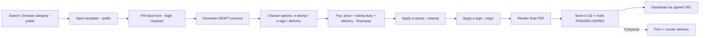

# 11 — Document Marketplace

A self-service, **Do-It-Yourself** store of common Indian legal documents. Users search or pick a
category, fill a guided form, optionally add an **e-stamp paper**, pay, and get the document delivered
online (PDF) — with optional **physical stamped delivery**. Modeled on the LegalDesk-style reference:
*"Get Stamp Paper + Legal Documents Delivered. All Online."* (Target feature; the `documents` module is
a stub today; `esign` / `estamp` common services already exist for signing and stamping.)

## Marketplace Landing Page (UI + Backend Spec)

Public, SEO-indexed landing at `/documents`.

### Layout

```
        Get Stamp Paper + Legal Documents Delivered. All Online!!
   Rental Agreements, Affidavits, NDAs & More — Legally Compliant Across India

   ┌──────────────────────────────────────────────┐ [🔍]
   │  Search Legal Documents                       │
   └──────────────────────────────────────────────┘

   ┌──────────┐ ┌──────────┐ ┌──────────┐ ┌────────────────┐
   │Affidavits│ │ Rental   │ │  Name    │ │ Contract &     │
   │          │ │Agreement │ │ Change   │ │ Agreements     │
   │ & More…  │ │ & More…  │ │ & More…  │ │ & More…        │
   └──────────┘ └──────────┘ └──────────┘ └────────────────┘

   How It Works?
   1) Pick a document  2) Fill details  3) Add stamp & pay  4) Get it delivered
```

### Elements

| Element | Behaviour | Backend |
|---|---|---|
| Hero copy | Value prop (stamp paper + docs, all online) | static / CMS |
| **Search Legal Documents** | typeahead over templates by title/keyword | `GET /api/documents/templates?q=` |
| **Category tiles** | Affidavits, Rental Agreement, Name Change, Contract & Agreements, **& More…** | `GET /api/documents/categories` |
| "How It Works?" | 4-step explainer (pick → fill → stamp & pay → delivered) | static |
| Disclaimer | legal disclaimer link | static |

- Category tiles link to `/documents/:categorySlug`; "& More…" expands the full category list.
- Search submits to `/documents/search?q=` backed by template title/keyword match (ElasticSearch later).
- No login to browse/search; login required to generate, stamp, pay, or download.

## Stamp Paper & Delivery

A key differentiator: documents can be issued on a **legally valid e-stamp paper** and delivered.

| Option | What the user gets | Service |
|---|---|---|
| **Digital (default)** | Final PDF, optionally e-signed | `esign` |
| **e-Stamp** | PDF generated on a state e-stamp paper of the required denomination | `estamp` |
| **e-Sign** | Aadhaar/secure e-signature applied to the document | `esign` |
| **Physical delivery** | Printed, stamped document couriered to an address | `estamp` + fulfilment/courier |

- **Stamp duty** varies by document type and state; the template declares whether stamping is required
  and the duty/denomination basis. The estamp service fetches/affixes the correct stamp.
- Delivery method (`DIGITAL` | `ESTAMP` | `PHYSICAL`) and, for physical, a delivery address are captured
  on the `CustomerDocument` at purchase time.
- Total price = template price + stamp duty (if any) + delivery fee (if physical).

## Categories

| Category | Examples |
|---|---|
| **Rent & Lease** | Rental agreement, leave & license, lease deed |
| **Property** | Sale deed, gift deed, NOC, possession letter |
| **Employment** | Offer letter, appointment letter, NDA, relieving letter |
| **Business** | Partnership deed, MoU, service agreement, vendor contract |
| **Consumer** | Consumer complaint, RTI application |
| **Family** | Will, affidavit of marriage, guardianship |
| **Affidavits** | Name change, address proof, income, gap affidavit |
| **Legal Notices** | Demand notice, cheque bounce notice, eviction notice |

Categories and templates are admin-managed ([10-admin-module.md](./10-admin-module.md)) and stored as
`DocumentCategory` / `DocumentTemplate` ([04-database-design.md](./04-database-design.md)).

## Generation Workflow



1. **Find** a document via search or category tiles (SEO-indexed, public).
2. **Fill** the template's input form (fields from `schemaJson`) — requires login.
3. **Preview** a watermarked DRAFT (`CustomerDocument` status `DRAFT → GENERATED`).
4. **Choose options:** e-stamp paper (if required/optional), e-sign, delivery method (digital/physical).
5. **Pay** template price + stamp duty + delivery fee via Razorpay.
6. **Stamp & sign:** estamp affixes the stamp paper; esign applies the signature.
7. **Render** the final, unwatermarked PDF and store it; status `PAID → DELIVERED`.
8. **Deliver:** download via signed URL anytime; if physical chosen, the stamped copy is couriered.

### How It Works (consumer-facing 4 steps)

1. **Pick a document** — search or choose a category.
2. **Fill the details** — answer a few guided questions.
3. **Add stamp & pay** — select e-stamp/e-sign/delivery, pay securely.
4. **Get it delivered** — download instantly, or receive the stamped copy by courier.

## Purchase Workflow

- `POST /api/documents/generate` — create a `CustomerDocument` draft from template + inputs.
- `POST /api/documents/:id/purchase` — create a Razorpay order (`Payment`, status `CREATED`).
- `POST /api/payments/verify` — verify signature; on success mark `Payment = PAID` and render final PDF.
- `GET /api/documents/:id/download` — owner-only, only when `PAID/DELIVERED`; returns a signed URL.

Pay-before-download is enforced server-side; drafts are watermarked and not downloadable as final.

## PDF Generation

- Templates use a placeholder body (`bodyTemplate`) filled from validated `inputJson`.
- Rendered server-side to PDF (headless renderer / PDF library).
- Optional **e-stamp** and **e-sign** via the `estamp` / `esign` common services for documents that require them.
- Final PDFs are immutable once `DELIVERED`.

## Storage

- Generated/purchased PDFs stored in S3/MinIO via the storage service.
- Access only through time-limited signed URLs scoped to the owning user.
- Drafts expire/clean up after a TTL if never purchased.

## Endpoints

| Method | Path | Auth | Purpose |
|---|---|---|---|
| GET | `/api/documents/categories` | Public | List categories (tiles) |
| GET | `/api/documents/templates?q=&category=` | Public | Search / browse templates ("Search Legal Documents") |
| GET | `/api/documents/templates/:id` | Public | Template detail + input schema + stamp/pricing |
| POST | `/api/documents/generate` | Auth | Generate draft from inputs |
| POST | `/api/documents/:id/options` | Auth | Set e-stamp / e-sign / delivery method (+ address) |
| POST | `/api/documents/:id/purchase` | Auth | Create payment order (price + stamp duty + delivery) |
| POST | `/api/payments/verify` | Auth | Confirm payment → stamp, sign, render final |
| GET | `/api/documents/:id/download` | Auth (owner, PAID) | Signed download URL |

The `q` parameter powers the "Search Legal Documents" bar (title/keyword match; ElasticSearch later).
Pricing on `templates/:id` includes base price plus whether stamping is required and the duty basis.

---
**Related:** [04-database-design.md](./04-database-design.md) · [10-admin-module.md](./10-admin-module.md) · [13-subscription-module.md](./13-subscription-module.md)


---

## Phase 1 — SHIPPED (guided form → preview → pay → download)

**Catalog:** templates carry `slug` (SEO URLs), lifecycle `DRAFT → PUBLISHED → ARCHIVED`,
`version` (content edits to a published template auto-bump), `language`. Only PUBLISHED
templates are public. Migration `doc_marketplace_p1`.

**Rendering:** mustache-lite `{{fieldName}}` engine server-side (HTML-escaped, blanks → ruled
lines). Free preview is **truncated** (~700 chars) + frontend watermark — the full text never
leaves the server unpaid. On payment the rendered text is **frozen** into
`CustomerDocument.contentHtml`, so later template edits never change a purchased document.

**Buyer flow:** `/legal-documents` (Start buttons live) → `/legal-documents/[slug]`
(Product JSON-LD, stamp-paper banner) → schema-driven form → preview → Razorpay checkout
(`POST /documents/checkout` → `verify-payment`; dev placeholder orders auto-verify) →
client dashboard **My Documents** (list + print view with stamp guidance + disclaimer).
Buyer answers ride the existing DPDP export/erase.

**Admin:** `/admin/documents` (OPS scope) — Templates (create draft, publish/archive, sales
counts), Categories CRUD, Orders (paginated). Editor at `/admin/documents/[id]`: details,
**form builder** (add/reorder/remove fields, click-to-insert `{{placeholders}}`), body editor,
sample preview. Publishes/price changes are audit-logged; every sale fires a
`DOCUMENT_PURCHASED` admin notification.

**Phase 2 (open):** server-side PDF (Puppeteer), Hindi templates, state stamp-duty tables,
courier delivery (schema fields exist), GST invoices for document sales, bundle offers,
lawyer-review upsell (creates a Lead). AI intake pre-fill: **shipped**.

---

## Phase 2 — LegalDesk flow analysis (July 2026)

Reviewed LegalDesk.com's live generation flow (rental agreement + name-change affidavit).
Their flow: SEO landing per document (long-form content, price upfront, validity infographic) →
**state selection** → tabbed form grouped by party (Agreement/Landlord/Tenant/Property/Rent/Terms) →
**live preview filling in as you type** → auto-saved drafts with a restore banner → pay →
download **or printed stamp paper home-delivered**.

Where we already win: AI prefill from the homepage intake conversation, and a real verified-lawyer
marketplace behind "need customization" (theirs is a contact form).

### P0 — SHIPPED (July 2026)

- **Live preview** (`DocumentWizard.tsx`): the watermarked preview re-renders ~800 ms after each
  keystroke (debounced, sequence-guarded; failures keep the last good preview). Blank fields render
  as ruled lines server-side, so the document takes shape from the first character. The manual
  "Free preview" button is gone.
- **Draft autosave + restore**: answers autosave to `localStorage` (`lm-doc-draft-<templateId>`,
  600 ms debounce). On return, saved answers restore with a banner + "Start fresh instead".
  Restore runs before AI prefill, and prefill only fills empty fields — saved answers always win.
- **Sectioned steps + toggle chips**: `TemplateField.section` (optional) groups fields into wizard
  steps with a numbered step nav, Back / **Save & Next** (per-step validation), pay button on the
  final step. Select fields with ≤ 4 options render as toggle chips (LegalDesk-style) instead of
  dropdowns. Templates without sections keep the single-form behavior — fully backward compatible.
  Admin form builder gained a "Section" input per field.

### P1 — next

1. **State selection per document** — stamp duty + clauses vary by state; capture state, vary
   template clauses, show correct duty guidance.
2. **"Make it valid" guidance** per template (admin-editable): print on stamp paper of ₹X → attest
   before two witnesses → register at sub-registrar where applicable. Shown post-purchase and on the
   landing page.
3. **Richer SEO landing per template** — long-form "What is / How to / FAQ" content + FAQ JSON-LD on
   `/legal-documents/[slug]` (their traffic engine).

### P2 — deliberately deferred

Stamp-paper printing + courier delivery and e-stamping tie-ups (SHCIL etc.), upload-your-own-document
stamping, phone-support line. Real differentiators but operations-heavy; our lawyer-routing wedge
comes first.
