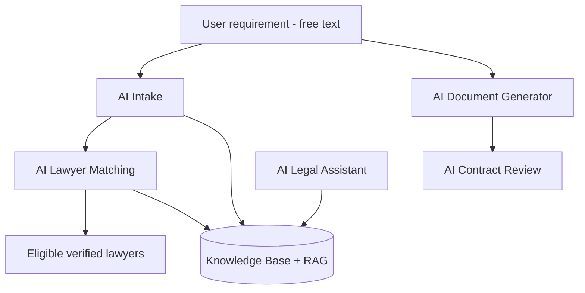

# 12 — AI Module

> **Status:** the AI Intake funnel is **shipped** (see "Shipped — intake funnel v2" below).
> The remaining components (matching, generator, review, assistant) are Phase 3 vision.

AI augments — never bypasses — the core rules: verification gating and subscription-based routing still
apply to every AI-assisted flow.

## Components

### AI Intake

- Turns a free-text problem ("my landlord won't return my deposit") into structured fields: practice
  area, urgency, location, summary.
- Output feeds lead creation and matching; user confirms before submission.

### AI Lawyer Matching

- Ranks eligible (`APPROVED`, non-`EXPIRED`) lawyers by semantic fit to the intake, plus rating,
  experience, location proximity, and premium boost.
- Explainable: surfaces *why* a lawyer matched (areas, location, experience).

### AI Document Generator

- Conversational generation of marketplace documents — asks for the inputs a template needs and
  drafts the body. Falls back to the structured template form.
- Always routes through the paid generation workflow ([11-document-marketplace.md](./11-document-marketplace.md)).

### AI Contract Review

- Upload a contract; AI flags risky clauses, missing protections, and plain-language summaries.
- Positioned as informational, with a clear "not legal advice" disclaimer and an upsell to contact a lawyer.

### AI Legal Assistant

- General Q&A chatbot grounded in the knowledge base (RAG), scoped to Indian law and platform help.
- Hands off to lawyer discovery / lead submission when a user needs real representation.

## Prompt Management

- Versioned, reviewable prompt templates per feature (intake, matching, generation, review, assistant).
- Centralised config; A/B-able; guardrail/system prompts separated from task prompts.
- Logged (without PII) for evaluation and regression testing.

## Knowledge Base & RAG

- Curated corpus: Indian statutes/sections (IPC/BNS references), practice-area explainers, document
  guides, platform FAQs.
- Chunked + embedded into a vector store; retrieval augments generation for grounded, citable answers.
- Refreshed as laws/templates change; admin-curated to control quality.

## Safety & Guardrails

- Every AI output carries a "not a substitute for legal advice" disclaimer.
- No fabricated citations — answers grounded in the KB or abstained.
- PII minimisation in prompts/logs; respect the same auth/role boundaries as the rest of the API.

---

## Shipped — intake funnel v2 (July 2026)

The homepage "What's your legal question?" box (`frontend/components/home/AskLegalBox.tsx` +
`backend/src/modules/ai-intake/`) implements a **hybrid deterministic-first funnel**. The LLM is an
enhancement layer only — every path has a zero-cost deterministic fallback, so the product works
identically when AI is disabled, failing, or out of quota.

### Funnel flow

1. **Keyword classifier** (`guidance-topics.ts` → `classifyQuestion`, score ≥ 2, phrases weigh 2) —
   free, instant, handles the majority of questions.
2. **Clarify trees** (`CLARIFIES`) — deterministic chip questions for ambiguous matches
   (family, money, criminal, general). Max depth 2.
3. **LLM interviewer** (Option C) — for unmatched input only: ≤ 3 chip questions, JSON-validated,
   topicKey whitelisted, falls back to the generic tree on any failure.
4. **Route step** — KB title/steps, document-template rows (no prices shown), Property Check row,
   gold "Talk to a verified lawyer" CTA last, carrying `practiceArea` (canonical seeded name) +
   saved/detected city into `/lawyers` search.
5. **Guidance summary** (`POST /ai-intake/ask`) — auto-opens before the lawyer CTA. LLM synthesis is
   KB-constrained when a topic matched; **generic QA** (below) when none did; verbatim KB text when
   AI is unavailable.

### Knowledge base (18 topics)

cheque-bounce · tenant-landlord · divorce-family · consumer (incl. travel/airline + e-commerce
return keywords) · criminal-fir · employment · property-purchase · encroachment · motor-accident ·
will-succession · loans-banking · cyber · **tax-notice · traffic-challan · ip-trademark ·
medical-negligence · passport-immigration · business-corporate** (added July 2026).
`PRACTICE_CANONICAL` maps topic tokens to exact seeded PracticeArea names because lawyer search
filters with case-insensitive **equality** — never pass fragments like "Property".

### Generic QA (unmatched questions)

When no KB topic matches, `llmGeneralAnswer()` produces a cautious general-information answer
(2–4 sentence summary + ≤ 5 steps). Guardrails: India-only general information, no advice/outcome
predictions/fee estimates, no uncertain citations, last step always "describe it to a verified
lawyer", JSON-validated. Falls back to the fixed KB fallback text on any failure.

### Non-legal questions

- AI live: the interviewer replies `{"final": "not-legal"}` immediately (no wasted questions) →
  friendly off-ramp card with sample legal questions.
- AI down: the generic clarify tree includes an "It's not a legal problem" escape chip (client-side,
  zero API calls).
- **Decision:** no keyword blacklist for non-legal input — food/travel words appear in real legal
  questions ("Swiggy didn't refund my order" is consumer); only context can tell, which is the
  interviewer's job. Occurrences are logged (`AiIntakeLog.topicKey = 'not-legal'`) for copy tuning.

### Cost & reliability controls (`llm.client.ts`)

- **Quota circuit breaker:** 429 quota errors pause ALL LLM calls — 30 min for daily/billing
  exhaustion, 60 s for per-minute spikes. While paused, `complete()` returns null instantly and the
  deterministic KB serves everyone. Never retry a 429.
- **Transient retry:** one retry after 1.5 s for 503/UNAVAILABLE/timeouts; a second failure also
  opens the 60 s breaker.
- **≤ 1 LLM call per summary:** the frontend passes the triage's `topicKey` to `/ai-intake/ask`, so
  the summary endpoint never re-classifies. 1 h in-memory answer cache (keyed on
  question+city+topic).
- Provider/model configured in admin Platform Settings (`AI_PROVIDER`, `AI_MODEL`, `AI_API_KEY`);
  Gemini default `gemini-flash-latest`, timeout 25 s, `maxOutputTokens` 2000 (thinking-token headroom).

### Tiering & intelligence

- Anonymous visitors: **3 free guidance summaries/day per IP** (in-memory; move to Redis for
  multi-instance), then a sign-up gate. Signed-in: unlimited.
- City detection: seeded-city lookup on question text (`detectCityInText`) feeds the saved city and
  the lawyer-search deep link.
- Every question is logged to `AiIntakeLog` (topic, matched, aiUsed); admin dashboard shows 30-day
  demand by topic + unmatched questions = **KB gap list**. Recurring gaps become free keyword rules
  (e.g. airline/e-commerce keywords came from real test questions).

---
**Related:** [11-document-marketplace.md](./11-document-marketplace.md) · [14-lead-management.md](./14-lead-management.md) · [15-search-and-matching.md](./15-search-and-matching.md)
