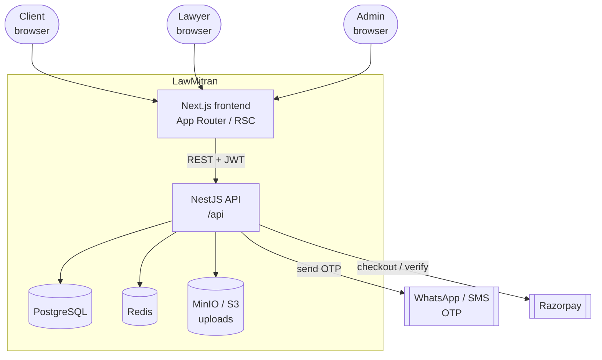
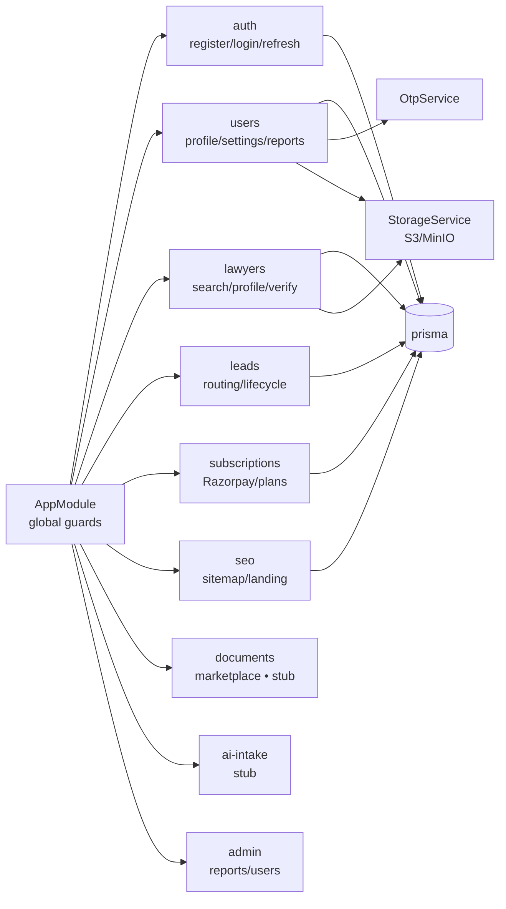
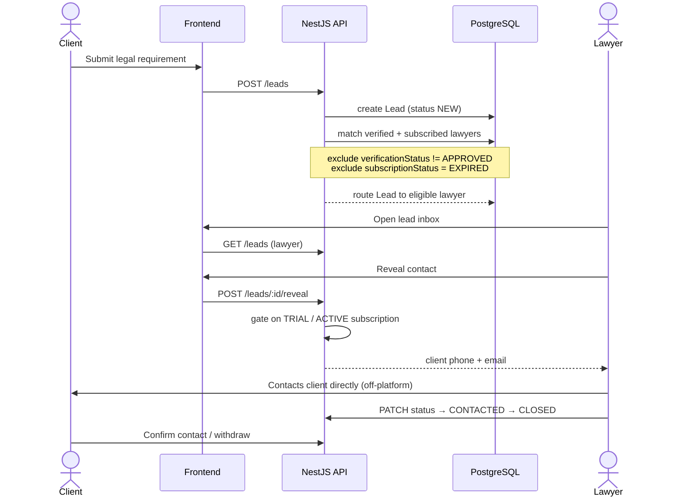
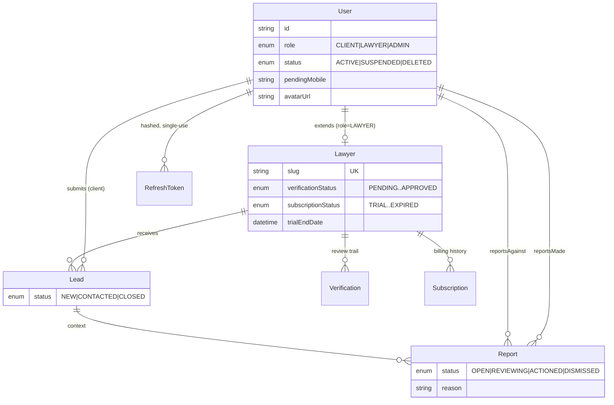
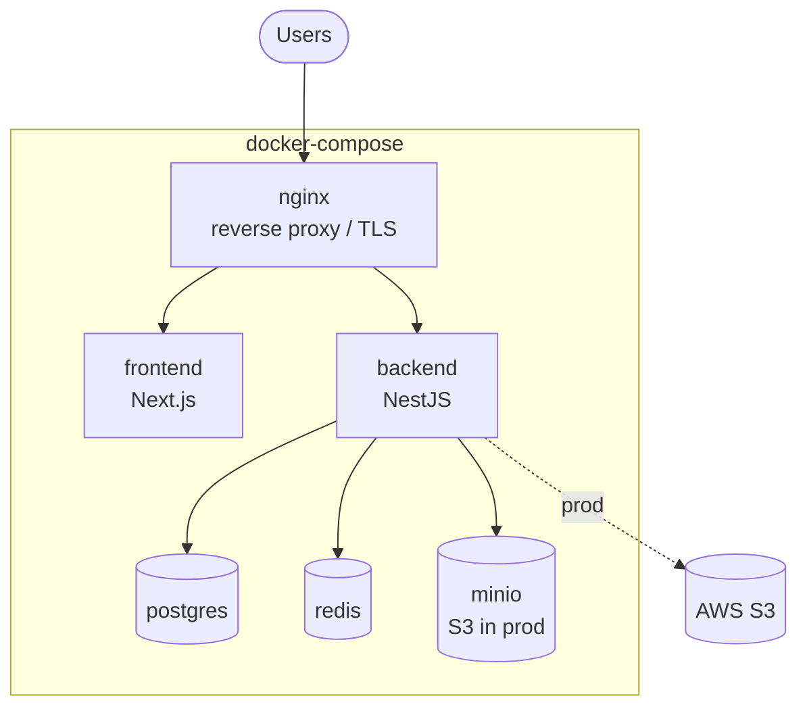

# Architecture Diagrams

Visual reference for LawMitran. Diagrams are [Mermaid](https://mermaid.js.org/) — they render on
GitHub and in most Markdown viewers. Prose reference: [03-system-architecture.md](./03-system-architecture.md).

---

## 1. System context

Who talks to what. LawMitran is a lead-generation marketplace: clients submit a legal requirement,
it routes to verified + subscribed lawyers as a lead, and the lawyer contacts the client directly.



---

## 2. Module map (backend)

NestJS feature modules. `auth`, `prisma`, `users`, `seo`, `lawyers` are implemented; the rest are
being filled in. Global `JwtAuthGuard` + `RolesGuard` wrap every route by default (opt out with
`@Public()`, gate with `@Roles()`).



---

## 3. Lead flow (the core loop)



---

## 4. Auth + signup OTP flow

Registration is WhatsApp-first OTP (cost-driven). OTP verification issues **no session** — the user
signs in with a password afterward. Access + refresh tokens are separate JWTs; refresh tokens are
stored SHA-256-hashed and single-use.

```mermaid
sequenceDiagram
    actor U as User
    participant FE as Frontend
    participant API as NestJS API
    participant WA as WhatsApp/SMS

    U->>FE: Sign up (role, mobile, password)
    FE->>API: POST /auth/register
    API-->>FE: created (no session)
    API->>WA: send OTP (hashed, cooldown/lockout)
    U->>FE: Enter 6-digit code
    FE->>API: POST /auth/verify-otp
    API-->>FE: verified ✓ (still no session)
    FE->>U: Redirect to /login
    U->>FE: Log in (password only)
    FE->>API: POST /auth/login
    API-->>FE: access + refresh JWT
    Note over FE: tokens in localStorage today;<br/>httpOnly-cookie hardening is a follow-up
```

---

## 5. Data model (core relationships)



---

## 6. Deployment



`docker compose up -d` brings up postgres, redis, minio, backend, frontend, and nginx. In production,
object storage moves from MinIO to S3 (`S3_FORCE_PATH_STYLE=false`).

---

**Related:** [03-system-architecture.md](./03-system-architecture.md) ·
[05-api-design.md](./05-api-design.md) · [26-frontend-implementation.md](./26-frontend-implementation.md) ·
[../STATUS.md](../STATUS.md) · [../ROADMAP.md](../ROADMAP.md)
