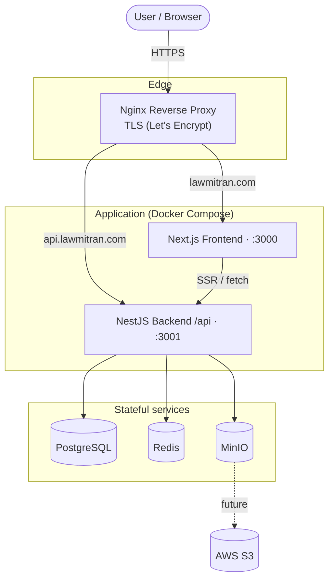

# 01 — Overall Architecture

## Components

- **Next.js frontend** (App Router) — SSR public/SEO pages, auth, client/lawyer/admin dashboards. Port `3000`.
- **NestJS backend** — REST API under `/api`, Swagger at `/api/docs`, global JWT + role guards. Port `3001`.
- **PostgreSQL** — primary datastore (Prisma).
- **Redis** — caching, rate limiting, session/OTP throttling, background job queue.
- **MinIO** — S3-compatible object storage for certificates/IDs/documents; migrates to AWS S3 later with no code change.
- **Nginx** — TLS termination and hostname-based reverse proxy.

All app and data services run as containers via **Docker Compose** on **Ubuntu 24.04 LTS**.

## Architecture diagram

> Source: [`diagrams/architecture.mmd`](./diagrams/architecture.mmd).

## Request flow

1. Browser hits Nginx over HTTPS.
2. Nginx routes by `Host`: frontend host → `:3000`, API host → `:3001`.
3. Public SEO requests render server-side and call the backend's `@Public()` endpoints (cacheable in Redis).
4. Authenticated requests carry a JWT; the global `JwtAuthGuard`/`RolesGuard` enforce access.
5. Uploads flow frontend → backend → MinIO; downloads are served via presigned URLs.

## Network topology

Two EC2 hosts (see [02](./02-aws-infrastructure.md)): Production dedicated; Development + QA on a shared box with isolated Docker Compose projects. Only ports 80/443 (public) and 22 (restricted) are open; database/cache/storage ports never leave the Docker network.

## Design principles (from the codebase)

Stateless app containers (scale horizontally later), generic reusable data models, SEO-first unauthenticated public pages, one API serving web today and mobile later.
