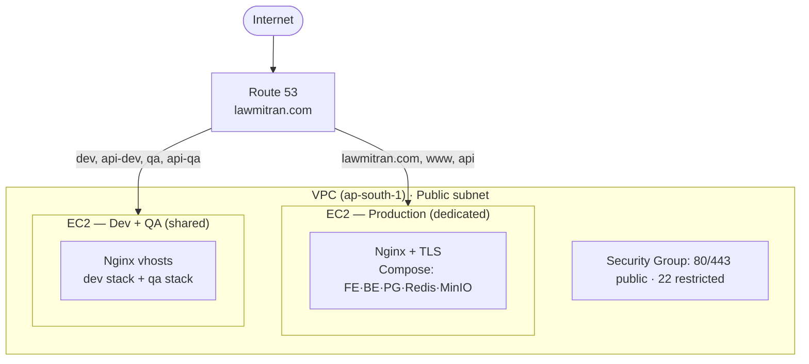
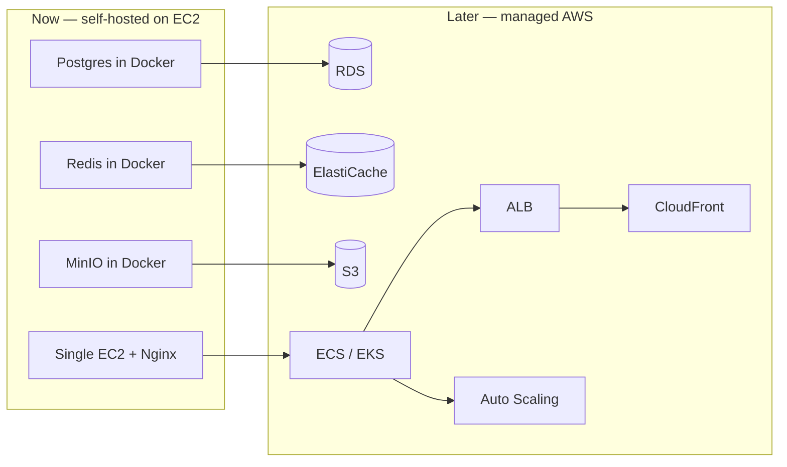

# 02 — AWS Infrastructure

Self-hosted model on EC2. AWS provides compute (EC2), storage (EBS), static IPs (Elastic IP), DNS (Route 53), and networking (VPC / Security Groups). Databases, cache, and object storage run **inside** EC2 via Docker Compose.

## Region

**`ap-south-1` (Mumbai)** — lowest latency for an India-focused platform, data-residency friendly. Keep everything in one region.

## Infrastructure diagram

> Source: [`diagrams/aws-infrastructure.mmd`](./diagrams/aws-infrastructure.mmd).

## Compute — EC2

| Instance | Role | Type | vCPU/RAM |
|---|---|---|---|
| `lawmitran-prod` | Production | `t3.medium`→`t3.large` | 2/4 GB+ |
| `lawmitran-shared` | Dev + QA | `t3.small`→`t3.medium` | 2/2–4 GB |

- AMI: **Ubuntu Server 24.04 LTS** (x86_64).
- **Elastic IP** per box so the public IP survives stop/start.

## Storage — EBS

- Root: 30–50 GB gp3.
- Recommended dedicated gp3 **data volume** mounted at `/opt/lawmitran/data` for Postgres + MinIO; enable daily EBS snapshots (Data Lifecycle Manager) on the prod data volume.

## Networking

- Default VPC is fine to start; a custom VPC with public subnets is cleaner long-term. Both boxes in a public subnet with an Internet Gateway.
- Security Groups detailed in [05](./05-security-groups.md).

## Future migration path

As traffic and data grow, lift services to managed AWS with **no application rewrite** (Prisma connection string / `@aws-sdk/client-s3` config only):

| Step | From | To | Benefit |
|---|---|---|---|
| 1 | Postgres in Docker | **RDS** (Multi-AZ) | Managed backups, failover |
| 2 | MinIO | **S3** | Durability, offload storage |
| 3 | Redis in Docker | **ElastiCache** | Managed cache/HA |
| 4 | Compose on EC2 | **ECS/EKS** | Orchestration, self-healing |
| 5 | Single instance | **ALB + Auto Scaling** | Horizontal scale, no single point |
| 6 | Nginx static edge | **CloudFront** | CDN, global caching, TLS at edge |

## Resource inventory (fill during rollout)

| Resource | Prod | Shared |
|---|---|---|
| Instance ID | `i-______` | `i-______` |
| Elastic IP | `__.__.__.__` | `__.__.__.__` |
| Data volume | `vol-______` | `vol-______` |
| Key pair | `lawmitran-prod.pem` | `lawmitran-shared.pem` |

Next: [03-domain-dns.md](./03-domain-dns.md).
