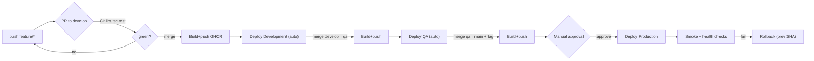

# 11 — GitHub Actions Workflows

Two pipelines: **CI** on every PR (lint, typecheck, test) and **CD** on merges to environment branches (build image → push to GHCR → SSH deploy). Branch → GitHub **Environment** mapping controls where it deploys and whether approval is required.

## Pipeline flowchart



> Source: [`diagrams/cicd-pipeline.mmd`](./diagrams/cicd-pipeline.mmd).

## CI — `.github/workflows/ci.yml`

```yaml
name: CI
on:
  pull_request:
    branches: [develop, qa, main]
jobs:
  test:
    runs-on: ubuntu-latest
    steps:
      - uses: actions/checkout@v4
      - uses: actions/setup-node@v4
        with: { node-version: 20, cache: npm }
      - run: npm ci
      - run: npm run lint --workspace backend
      - run: npm run lint --workspace frontend
      - name: Typecheck frontend
        run: npx tsc --noEmit
        working-directory: frontend
      - run: npm run test --workspace backend
```

## CD — `.github/workflows/deploy.yml`

```yaml
name: Deploy
on:
  push:
    branches: [develop, qa, main]

jobs:
  build-and-push:
    runs-on: ubuntu-latest
    permissions: { contents: read, packages: write }
    outputs:
      tag: ${{ steps.meta.outputs.tag }}
    steps:
      - uses: actions/checkout@v4
      - id: meta
        run: echo "tag=${GITHUB_SHA::7}" >> "$GITHUB_OUTPUT"
      - uses: docker/login-action@v3
        with:
          registry: ghcr.io
          username: ${{ github.actor }}
          password: ${{ secrets.GITHUB_TOKEN }}
      - uses: docker/build-push-action@v6
        with:
          context: .
          file: ./backend/Dockerfile
          push: true
          tags: ghcr.io/${{ github.repository_owner }}/lawmitran-backend:${{ steps.meta.outputs.tag }}
      - uses: docker/build-push-action@v6
        with:
          context: .
          file: ./frontend/Dockerfile
          push: true
          build-args: |
            NEXT_PUBLIC_API_URL=${{ vars.API_URL }}
          tags: ghcr.io/${{ github.repository_owner }}/lawmitran-frontend:${{ steps.meta.outputs.tag }}

  deploy:
    needs: build-and-push
    runs-on: ubuntu-latest
    environment: >-
      ${{ github.ref_name == 'main' && 'production'
        || github.ref_name == 'qa' && 'qa'
        || 'development' }}
    steps:
      - uses: appleboy/ssh-action@v1
        with:
          host: ${{ secrets.DEPLOY_HOST }}
          username: ${{ secrets.DEPLOY_USER }}
          key: ${{ secrets.DEPLOY_SSH_KEY }}
          script: |
            cd ${{ vars.DEPLOY_PATH }}
            export IMAGE_TAG=${{ needs.build-and-push.outputs.tag }}
            export DATA_DIR=${{ vars.DATA_DIR }}
            docker compose -p ${{ vars.PROJECT }} pull
            docker compose -p ${{ vars.PROJECT }} run --rm backend npx prisma migrate deploy
            docker compose -p ${{ vars.PROJECT }} up -d
            docker image prune -f
```

## GitHub Environments (Settings → Environments)

Create `development`, `qa`, `production`, each with scoped secrets/variables:

| Key | Type | Dev | QA | Prod |
|---|---|---|---|---|
| `DEPLOY_HOST` | secret | shared EIP | shared EIP | prod EIP |
| `DEPLOY_USER` | secret | `deploy` | `deploy` | `deploy` |
| `DEPLOY_SSH_KEY` | secret | key | key | key |
| `DEPLOY_PATH` | var | `/opt/lawmitran/dev` | `/opt/lawmitran/qa` | `/opt/lawmitran/prod` |
| `PROJECT` | var | `lawmitran-dev` | `lawmitran-qa` | `lawmitran-prod` |
| `DATA_DIR` | var | `.../data/dev` | `.../data/qa` | `.../data/prod` |
| `API_URL` | var | `https://api-dev.lawmitran.com/api` | `https://api-qa...` | `https://api...` |

On **`production`**, add a **Required reviewer** — the deploy job pauses until approved (the manual gate).

## Zero-downtime & rollback

The deploy step can be swapped for the blue-green flow in [17](./17-zero-downtime-deployment.md). Rollback re-runs the deploy with an older `IMAGE_TAG` — see [18](./18-rollback.md).

Next: [12-branching-strategy.md](./12-branching-strategy.md).
