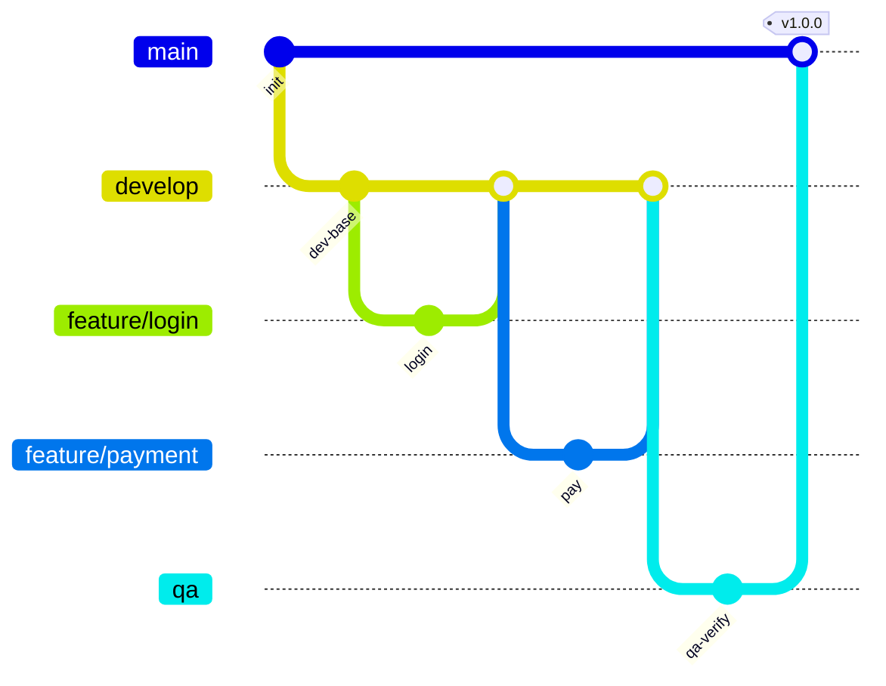

# 12 — Branching Strategy (GitFlow Lite)

Three long-lived branches, one per environment, with short-lived feature branches. Code is **promoted upward**: `feature/* → develop → qa → main`. No `release/*` branches.

## Branch graph



> Source: [`diagrams/branch-strategy.mmd`](./diagrams/branch-strategy.mmd).

## Branches

| Branch | Type | From | Merges to | Environment | Deploy |
|---|---|---|---|---|---|
| `feature/*` | short | `develop` | `develop` (PR) | — | CI on PR |
| `develop` | long | — | `qa` | Development | Auto |
| `qa` | long | — | `main` | QA | Auto |
| `main` | long | — | — | Production | Manual approval |
| `hotfix/*` | short | `main` | `main` (+ back-merge) | Production | via `main` |

Your feature branches — `feature/login`, `feature/payment`, `feature/lawyer-search`, `feature/documents` — all branch from `develop` and PR back into it.

## Promotion flow

```
feature/*  ──►  develop  ──►  qa  ──►  main
   PR           Dev          QA        Prod (approval + tag)
```

1. **Feature** — branch from `develop`, PR back; CI (lint + `tsc --noEmit` + tests) must pass.
2. **Development** — merge to `develop` auto-deploys to Dev.
3. **QA** — merge `develop → qa` auto-deploys to QA for UAT/regression.
4. **Production** — on QA sign-off, merge `qa → main`, tag `vX.Y.Z`; prod deploy waits for approval.

Promotion is always an upward merge, so `main ⊆ qa ⊆ develop` — every environment is a clean superset of the one above it.

## Bug fixes found in QA

Fix on a `feature/*` (or `fix/*`) branch off **`develop`**, PR into `develop`, then re-promote `develop → qa`. Keeps `develop` the single source of truth. Reserve `hotfix/*` for production emergencies.

## Hotfixes

Branch `hotfix/*` from `main`, PR to `main`, tag a patch, deploy (approval still applies), then **back-merge `main → qa → develop`** so the fix isn't lost.

## Branch protection

For `develop`, `qa`, `main`: require PR + review (≥1) + passing CI; block direct pushes and force-push. `main` additionally requires the version tag.

## Conventions

- Branches: `feature/<desc>`, `fix/<desc>`, `hotfix/<desc>`.
- Commits: Conventional Commits (`feat:`, `fix:`, `chore:`…).
- Tags: `vMAJOR.MINOR.PATCH` on `main`; tag SHA == deployed image tag.

Next: [13-postgresql.md](./13-postgresql.md).
