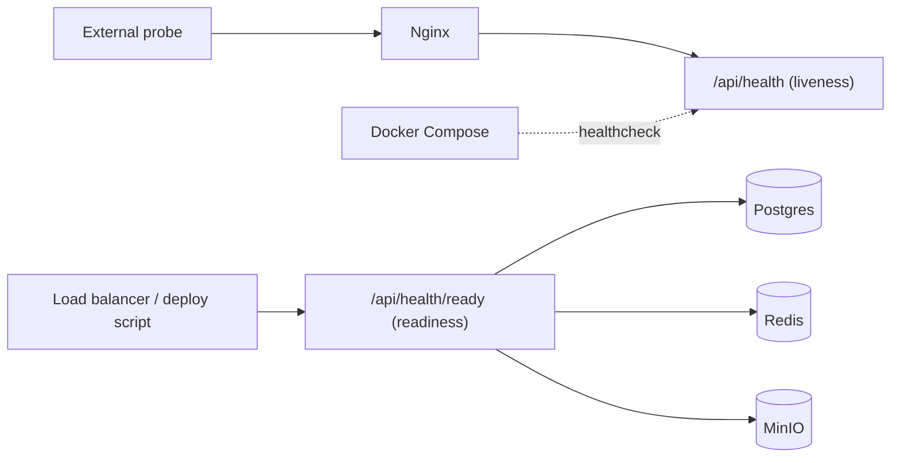

# 16 — Health Checks

Health checks make the platform self-observing at three layers: **application endpoints**, **container healthchecks**, and **external uptime probes**.

## 1. Application endpoints (NestJS)

Expose lightweight endpoints using `@nestjs/terminus`:

| Endpoint | Purpose | Auth |
|---|---|---|
| `GET /api/health` | Liveness — process is up | `@Public()` |
| `GET /api/health/ready` | Readiness — DB + Redis + MinIO reachable | `@Public()` |

```ts
// health.controller.ts (sketch)
@Public()
@Get('health')
liveness() { return { status: 'ok' }; }

@Public()
@Get('health/ready')
readiness() {
  return this.health.check([
    () => this.db.pingCheck('postgres'),
    () => this.redis.pingCheck('redis'),
    () => this.storage.pingCheck('minio'),
  ]);
}
```

- **Liveness** must be cheap (no dependency calls) — it answers "should this container be restarted?"
- **Readiness** checks dependencies — it answers "can this container receive traffic?" Used by the zero-downtime cutover ([17](./17-zero-downtime-deployment.md)).

Return `200` when healthy, `503` when not. Keep `/api/health` fast; don't log it (Nginx `access_log off`).

## 2. Container healthchecks (Docker Compose)

Every service declares a `healthcheck` (see [07](./07-docker-compose.md)):

| Service | Test |
|---|---|
| backend | `wget -qO- http://localhost:3001/api/health` |
| postgres | `pg_isready -U $POSTGRES_USER` |
| redis | `redis-cli -a $REDIS_PASSWORD ping` |
| minio | `mc ready local` |

Combined with `depends_on: { condition: service_healthy }` and `restart: always`, containers start in the right order and unhealthy ones are restarted automatically.

## 3. External uptime probes

An external monitor (UptimeRobot / Healthchecks.io / BetterStack) hits, every 1–5 min:

- `https://lawmitran.com` (frontend)
- `https://api.lawmitran.com/api/health` (backend liveness)

Alerts to email/Slack on failure — the fastest signal that production is down. Also monitor TLS expiry here ([09](./09-ssl.md)). Full monitoring stack in [19](./19-monitoring.md).

## Nginx passthrough

The API vhost exposes `/api/health` with `access_log off` ([08](./08-nginx.md)) so probes don't pollute logs.

## Health-check matrix



Next: [17-zero-downtime-deployment.md](./17-zero-downtime-deployment.md).
