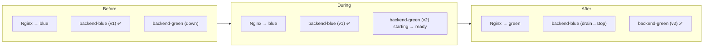

# 17 — Zero-Downtime Deployment

Goal: ship a new version with no dropped requests. On a single Docker Compose host we use a **blue-green** pattern behind Nginx: bring up the new colour, wait for its readiness check, flip Nginx to it, then retire the old colour.

## Strategy overview



## Nginx upstream

`/etc/nginx/conf.d/upstream.conf`:

```nginx
upstream backend_pool { server 127.0.0.1:3001; }   # active colour
upstream frontend_pool { server 127.0.0.1:3000; }
```

Vhosts `proxy_pass http://backend_pool;` / `http://frontend_pool;`. The deploy flips the `server` line and runs `nginx -s reload` (graceful — in-flight requests finish on the old worker).

## Deploy script (blue-green)

`deploy.sh` on the box (invoked by the CD SSH step, [11](./11-github-actions.md)):

```bash
#!/usr/bin/env bash
set -euo pipefail
PROJECT=lawmitran-prod
NEW=${IMAGE_TAG}
ACTIVE=$(cat /opt/lawmitran/prod/.active 2>/dev/null || echo blue)
NEXT=$([ "$ACTIVE" = blue ] && echo green || echo blue)

# Ports: blue backend 3001 / frontend 3000 ; green backend 3011 / frontend 3010
case $NEXT in
  green) BE=3011; FE=3010 ;;
  blue)  BE=3001; FE=3000 ;;
esac

# 1. migrations (backward-compatible — see 13/18)
IMAGE_TAG=$NEW docker compose -p $PROJECT run --rm backend npx prisma migrate deploy

# 2. start the NEXT colour
IMAGE_TAG=$NEW docker compose -p ${PROJECT}-${NEXT} \
  -f docker-compose.yml -f docker-compose.${NEXT}.yml up -d

# 3. wait for readiness
for i in $(seq 1 30); do
  curl -fsS http://127.0.0.1:${BE}/api/health/ready && break
  sleep 2
  [ "$i" = 30 ] && { echo "readiness failed"; exit 1; }
done

# 4. flip Nginx upstreams to NEXT, reload gracefully
sed -i "s/127.0.0.1:[0-9]*/127.0.0.1:${BE}/" /etc/nginx/conf.d/upstream.conf
sudo nginx -t && sudo nginx -s reload

# 5. drain + stop the OLD colour
sleep 10
docker compose -p ${PROJECT}-${ACTIVE} down

echo $NEXT > /opt/lawmitran/prod/.active
```

## Key requirements

- **Backward-compatible migrations** ([13](./13-postgresql.md)) — the old colour must keep working against the new schema during the overlap.
- **Readiness gate** ([16](./16-health-checks.md)) — never flip traffic until the new colour reports ready.
- **Graceful Nginx reload** — `nginx -s reload` drops zero connections.
- **Graceful shutdown** — NestJS should handle `SIGTERM` (enable shutdown hooks) so in-flight requests finish before the old colour stops.

## Simpler alternative (rolling)

For lower-risk envs, `docker compose up -d` with `restart: always` + healthchecks gives a brief blip but far less complexity. Reserve blue-green for production.

## Future

ECS/EKS + ALB ([02](./02-aws-infrastructure.md)) provide native rolling / blue-green deployments with target-group health checks, removing the hand-rolled script.

Next: [18-rollback.md](./18-rollback.md).
