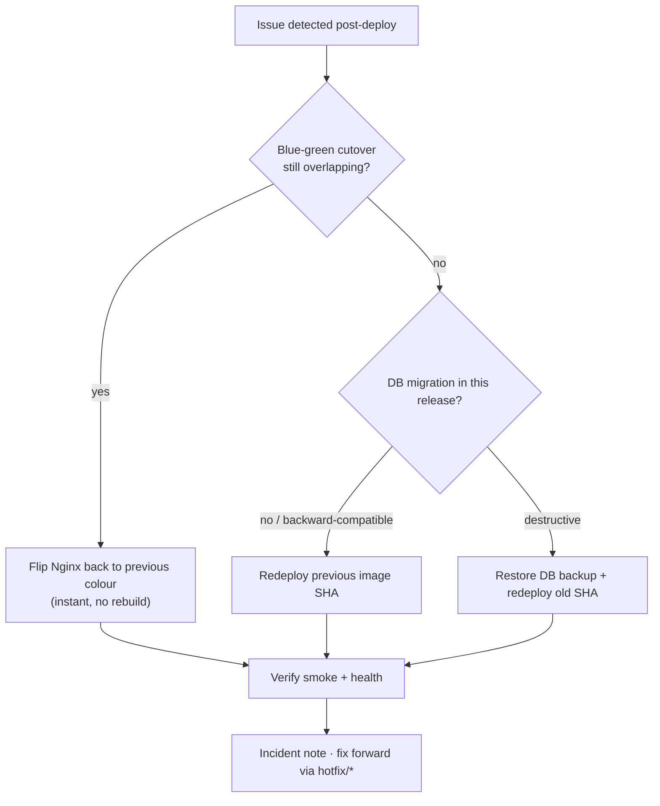

# 18 — Rollback Procedure

Every image is tagged by **commit SHA** and kept in GHCR, so rolling back is redeploying a known-good tag. Rollback is fast because the previous colour/image is still available.

## When to roll back

- Post-deploy smoke test or health check fails ([16](./16-health-checks.md), [22](./22-deployment-checklist.md)).
- Error rate / 5xx spike after a release ([19](./19-monitoring.md)).
- A critical regression reported in production.

## Decision flow



## Method 1 — Blue-green flip (fastest)

If the old colour is still up (within the drain window of [17](./17-zero-downtime-deployment.md)):

```bash
# point Nginx back at the previous colour's port and reload
sed -i "s/127.0.0.1:[0-9]*/127.0.0.1:3001/" /etc/nginx/conf.d/upstream.conf
sudo nginx -t && sudo nginx -s reload
```

No image pull, no restart — traffic returns to the previous version immediately.

## Method 2 — Redeploy previous SHA

```bash
cd /opt/lawmitran/prod
export IMAGE_TAG=<previous-good-sha>
export DATA_DIR=/opt/lawmitran/data/prod
docker compose -p lawmitran-prod pull
docker compose -p lawmitran-prod up -d
```

Or re-run the GitHub **Deploy** workflow pinned to the previous commit / SHA.

## Method 3 — With database rollback (last resort)

Only if a **destructive** migration shipped (avoid this by using expand/contract migrations, [13](./13-postgresql.md)):

```bash
docker compose -p lawmitran-prod stop backend
gunzip -c /opt/lawmitran/data/backups/pg-<pre-deploy>.sql.gz | \
  docker compose -p lawmitran-prod exec -T postgres psql -U lawmitran -d lawmitran_prod
export IMAGE_TAG=<previous-good-sha>
docker compose -p lawmitran-prod up -d backend
```

Because a fresh backup is taken **before** every prod deploy ([22](./22-deployment-checklist.md)), the pre-deploy dump always exists.

## After rollback

1. Confirm smoke test + health checks pass on the restored version.
2. Keep the failed image/tag for investigation.
3. Write a short incident note (what, when, impact, root cause).
4. Fix forward on a `hotfix/*` branch ([12](./12-branching-strategy.md)); don't re-promote the bad SHA.

## Retention

Keep the last several image SHAs in GHCR and on-box (don't over-prune) so multiple rollback targets exist.

Next: [19-monitoring.md](./19-monitoring.md).
