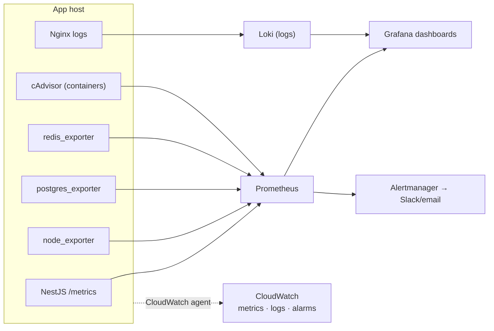

# 19 — Monitoring (Prometheus · Grafana · CloudWatch)

Layered observability: start with uptime + logs, then add a metrics stack (Prometheus + Grafana), and use CloudWatch for host/infra metrics and alarms.

## Monitoring stack diagram



## Layer 1 — Uptime (do first)

External probes on `lawmitran.com` and `api.lawmitran.com/api/health` ([16](./16-health-checks.md)); alert on failure and TLS expiry.

## Layer 2 — Logs

- **Application**: `docker compose logs`; JSON-file driver with rotation ([06](./06-docker.md)).
- **Nginx**: `/var/log/nginx/{access,error}.log` per vhost — first stop for 4xx/5xx and latency.
- Optionally ship logs to **Loki** (queryable in Grafana) or **CloudWatch Logs** via the CloudWatch agent.

## Layer 3 — Metrics (Prometheus + Grafana)

Run the monitoring stack as its own Compose project (on the shared box or a small dedicated box):

```yaml
services:
  prometheus:
    image: prom/prometheus
    volumes: ["./prometheus.yml:/etc/prometheus/prometheus.yml", "prom-data:/prometheus"]
    ports: ["127.0.0.1:9090:9090"]
  grafana:
    image: grafana/grafana
    environment: [GF_SECURITY_ADMIN_PASSWORD=${GRAFANA_PW}]
    volumes: ["grafana-data:/var/lib/grafana"]
    ports: ["127.0.0.1:3001:3000"]     # behind Nginx + auth
  node-exporter: { image: prom/node-exporter }
  cadvisor: { image: gcr.io/cadvisor/cadvisor }
  postgres-exporter: { image: prometheuscommunity/postgres-exporter }
  redis-exporter: { image: oliver006/redis_exporter }
volumes: { prom-data: {}, grafana-data: {} }
```

`prometheus.yml` scrapes:

```yaml
scrape_configs:
  - job_name: backend         # NestJS /metrics via prom-client
    metrics_path: /metrics
    static_configs: [{ targets: ['backend:3001'] }]
  - job_name: node
    static_configs: [{ targets: ['node-exporter:9100'] }]
  - job_name: containers
    static_configs: [{ targets: ['cadvisor:8080'] }]
  - job_name: postgres
    static_configs: [{ targets: ['postgres-exporter:9187'] }]
  - job_name: redis
    static_configs: [{ targets: ['redis-exporter:9121'] }]
```

Expose the NestJS `/metrics` endpoint with `prom-client` (request rate, latency histograms, event-loop lag, BullMQ queue depth). Grafana dashboards visualize; **Alertmanager** routes alerts to Slack/email.

## Layer 4 — CloudWatch (AWS-native)

Install the **CloudWatch agent** on each EC2 box to push CPU / memory / disk / network metrics and (optionally) logs, then define **CloudWatch Alarms** (e.g. CPU > 80% 5 min, disk > 80%, status-check failed). This covers host/infra health independently of the in-box Prometheus stack and is the natural bridge to the future managed setup (RDS/ElastiCache/ALB all emit CloudWatch metrics).

Optional: **Sentry** for backend/frontend exception tracking with stack traces.

## What to watch (prod)

| Signal | Alert when |
|---|---|
| FE + API health | down > 2 min |
| 5xx rate (Nginx / app) | spike above baseline |
| p95 latency | sustained regression |
| CPU / memory | > 80% sustained |
| Disk on data volume | > 80% |
| Cert expiry | < 14 days |
| BullMQ queue depth | growing unbounded |
| Backup job | missed nightly run |

## Rollout order

1. Uptime + `/api/health` alerts.
2. Log rotation + disk/cert alerts + CloudWatch agent/alarms.
3. Prometheus + Grafana + exporters + `/metrics`.
4. Alertmanager routing + Sentry.

Next: [20-backup-disaster-recovery.md](./20-backup-disaster-recovery.md).
