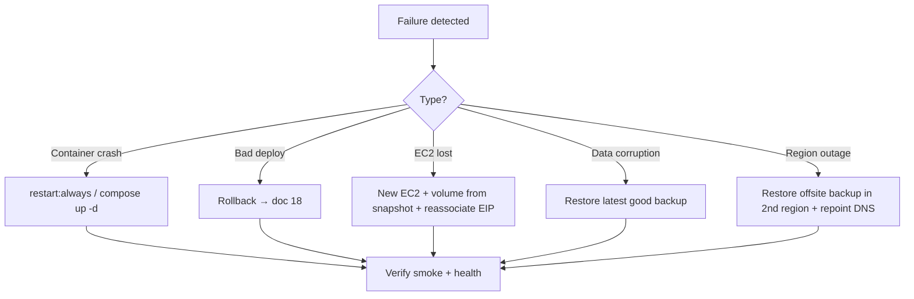

# 20 — Backup & Disaster Recovery

Self-hosting means **you own backups**. Production backups are mandatory; Dev/QA are disposable/reconstructable.

## What to back up (Prod)

| Asset | Method | Frequency | Retention |
|---|---|---|---|
| PostgreSQL | `pg_dump` (logical) | Nightly | 7 daily + 4 weekly |
| MinIO objects | `mc mirror` | Nightly | Mirror + weekly archive |
| EBS data volume | Snapshot (DLM) | Daily | 7 snapshots |
| `.env` / secrets | Secrets manager / encrypted vault | On change | Versioned |
| Nginx / compose config | Git (this repo) | On change | Git history |

Layered on purpose: logical dumps give portable point-in-time restores; EBS snapshots give fast whole-volume recovery.

## Backup script

`/opt/lawmitran/prod/backup.sh`:

```bash
#!/usr/bin/env bash
set -euo pipefail
STAMP=$(date +%F)
DEST=/opt/lawmitran/data/backups
mkdir -p "$DEST"

# Postgres
docker compose -p lawmitran-prod exec -T postgres \
  pg_dump -U lawmitran lawmitran_prod | gzip > "$DEST/pg-$STAMP.sql.gz"

# MinIO
docker run --rm --network lawmitran-prod_default \
  -v "$DEST/minio:/backup" minio/mc sh -c \
  "mc alias set local http://minio:9000 $MINIO_ROOT_USER $MINIO_ROOT_PASSWORD && \
   mc mirror --overwrite local/lawmitran-prod /backup"

# Offsite (separate bucket / region)
mc cp "$DEST/pg-$STAMP.sql.gz" offsite/lawmitran-backups/pg/
mc mirror --overwrite "$DEST/minio" offsite/lawmitran-backups/minio/

# Prune local older than 14 days
find "$DEST" -name 'pg-*.sql.gz' -mtime +14 -delete
```

Cron (as `deploy`):

```cron
0 2 * * * /opt/lawmitran/prod/backup.sh >> /var/log/lawmitran-backup.log 2>&1
```

**Offsite is essential** — a backup on the same EBS as the database dies with it.

## Restore procedures

### PostgreSQL

```bash
docker compose -p lawmitran-prod stop backend
gunzip -c /opt/lawmitran/data/backups/pg-<date>.sql.gz | \
  docker compose -p lawmitran-prod exec -T postgres psql -U lawmitran -d lawmitran_prod
docker compose -p lawmitran-prod start backend
```

### MinIO

```bash
mc mirror --overwrite offsite/lawmitran-backups/minio/ local/lawmitran-prod
```

### Whole box (EBS)

Create a new volume from the latest snapshot → attach to a replacement instance → mount at `/opt/lawmitran/data` → `docker compose up -d` → **reassociate the Elastic IP** (DNS unchanged).

## DR objectives

| Metric | Target | Notes |
|---|---|---|
| **RPO** (max data loss) | ≤ 24h | Tighten with 6-hourly dumps or WAL archiving |
| **RTO** (max downtime) | ≤ 2–4h | Shrink with a pre-baked AMI |

## DR runbooks



- **Container crash** — `restart: always` + healthchecks usually auto-recover; else `docker compose up -d`.
- **Bad deploy / migration** — see [18-rollback.md](./18-rollback.md).
- **Production EC2 lost** — rebuild from AMI or [04](./04-ec2-setup.md); restore data volume from snapshot; restore `.env` (from vault) + compose (from git); reassociate Elastic IP; smoke test.
- **Data corruption / deletion** — stop backend, restore last-good dump into a fresh DB, verify integrity, switch over.
- **Shared box lost** — no prod impact; rebuild, redeploy `develop`/`qa`, re-seed Dev, reload sanitized data into QA.
- **Region/AZ outage** — keep offsite backups in a second region; document region-relaunch + DNS repoint. Long-term fix is Multi-AZ RDS + cross-region S3 replication ([02](./02-aws-infrastructure.md)).

## Test restores

An untested backup is not a backup. **Quarterly**: restore the latest prod dump into a scratch DB (or QA), verify row counts and key records, and record elapsed time (your real RTO).

## QA data refresh

Prod dump → **mask PII** (names, emails, phones, ID URLs) → load into `lawmitran_qa`. Never load raw prod PII into QA.

Next: [21-security-best-practices.md](./21-security-best-practices.md).
